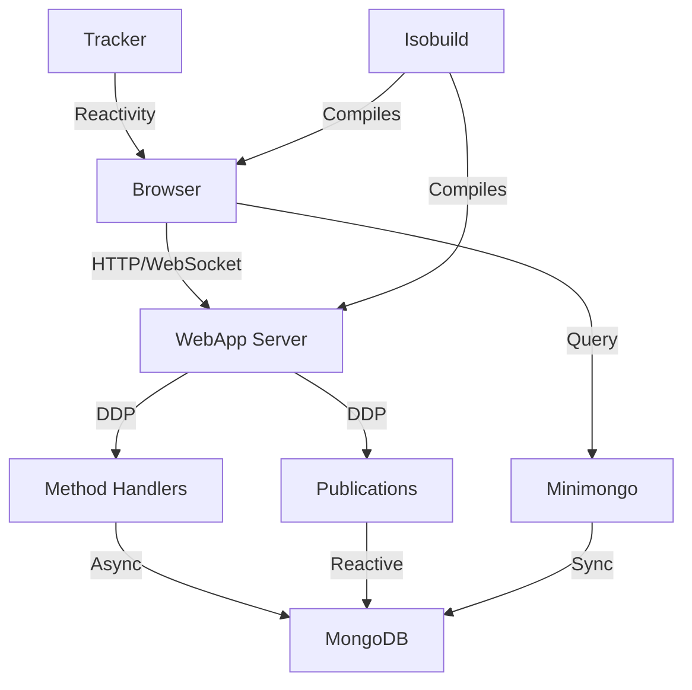

## The Full Stack

Meteor is a complete platform for building modern web applications. Unlike traditional stacks where you assemble different tools, Meteor provides an integrated solution from database to deployment.

<Note>
  With Meteor, you write JavaScript across your entire stack: database queries, server logic, client code, and build configuration all use the same language and paradigms.
</Note>

## The Meteor Stack



### Technology Layers

<CardGroup cols={2}>
  <Card title="Database Layer" icon="database">
    **MongoDB + Minimongo**
    - Server: MongoDB with Node.js driver
    - Client: Minimongo (in-memory cache)
    - Automatic synchronization via DDP
  </Card>
  
  <Card title="Data Layer" icon="sync">
    **DDP Protocol**
    - WebSocket-based real-time protocol
    - Publications for data subscriptions
    - Methods for RPC calls
    - Latency compensation
  </Card>
  
  <Card title="Server Layer" icon="server">
    **Node.js + Express**
    - Built on Node.js runtime
    - Express-based HTTP server (webapp)
    - Async/await throughout
    - npm package ecosystem
  </Card>
  
  <Card title="Client Layer" icon="laptop">
    **Modern Browser**
    - React, Vue, Blaze, or Svelte
    - ES2015+ JavaScript
    - Hot Module Replacement
    - Service workers support
  </Card>
  
  <Card title="Build Layer" icon="hammer">
    **Isobuild**
    - Universal build system
    - Multi-architecture compilation
    - Tree shaking and code splitting
    - Modern bundler (Rspack)
  </Card>
  
  <Card title="Reactivity Layer" icon="bolt">
    **Tracker**
    - Transparent reactivity
    - Automatic UI updates
    - Computation graph
    - Framework integration
  </Card>
</CardGroup>

## Building a Complete App

Let's build a task management app to see how all pieces work together.

### 1. Define the Data Model

Create collections that work on both client and server:

```javascript imports/api/tasks/tasks.js
import { Mongo } from 'meteor/mongo';
import { z } from 'zod';

// Define collection
export const Tasks = new Mongo.Collection('tasks');

// Define schema with Zod
export const TaskSchema = z.object({
  text: z.string().min(1).max(200),
  completed: z.boolean().default(false),
  createdAt: z.date(),
  userId: z.string(),
  projectId: z.string().optional(),
  dueDate: z.date().optional(),
  tags: z.array(z.string()).default([])
});

// Helper for validation
export function validateTask(task) {
  return TaskSchema.parse(task);
}
```

### 2. Create Server Methods

Define server-side business logic:

```javascript imports/api/tasks/methods.js
import { Meteor } from 'meteor/meteor';
import { check } from 'meteor/check';
import { Tasks, validateTask } from './tasks';

Meteor.methods({
  async 'tasks.insert'(taskData) {
    // Validate user is logged in
    if (!this.userId) {
      throw new Meteor.Error('not-authorized', 'You must be logged in');
    }
    
    // Validate input
    const task = validateTask({
      ...taskData,
      userId: this.userId,
      createdAt: new Date()
    });
    
    // Insert task
    const taskId = await Tasks.insertAsync(task);
    
    // Log activity (async operation)
    await Meteor.callAsync('activity.log', {
      type: 'task.created',
      taskId
    });
    
    return taskId;
  },
  
  async 'tasks.setCompleted'(taskId, completed) {
    check(taskId, String);
    check(completed, Boolean);
    
    // Verify ownership
    const task = await Tasks.findOneAsync({
      _id: taskId,
      userId: this.userId
    });
    
    if (!task) {
      throw new Meteor.Error('not-found', 'Task not found');
    }
    
    // Update task
    await Tasks.updateAsync(taskId, {
      $set: { 
        completed,
        completedAt: completed ? new Date() : null
      }
    });
  },
  
  async 'tasks.remove'(taskId) {
    check(taskId, String);
    
    const task = await Tasks.findOneAsync({
      _id: taskId,
      userId: this.userId
    });
    
    if (!task) {
      throw new Meteor.Error('not-found');
    }
    
    await Tasks.removeAsync(taskId);
  }
});
```

### 3. Create Publications

Define what data clients can access:

```javascript imports/api/tasks/publications.js
import { Meteor } from 'meteor/meteor';
import { check, Match } from 'meteor/check';
import { Tasks } from './tasks';

// Publish user's tasks with optional filtering
Meteor.publish('tasks', function(filter = {}) {
  check(filter, {
    completed: Match.Optional(Boolean),
    projectId: Match.Optional(String),
    tags: Match.Optional([String])
  });
  
  if (!this.userId) {
    return this.ready();
  }
  
  // Build query
  const query = {
    userId: this.userId,
    ...filter
  };
  
  // Return cursor
  return Tasks.find(query, {
    sort: { createdAt: -1 },
    limit: 100,
    fields: {
      text: 1,
      completed: 1,
      createdAt: 1,
      dueDate: 1,
      tags: 1
    }
  });
});

// Publish single task with full details
Meteor.publish('tasks.single', function(taskId) {
  check(taskId, String);
  
  return Tasks.find({
    _id: taskId,
    userId: this.userId
  });
});

// Publish task statistics
Meteor.publish('tasks.stats', function() {
  if (!this.userId) {
    return this.ready();
  }
  
  let total = 0;
  let completed = 0;
  
  const handle = Tasks.find({
    userId: this.userId
  }).observeChanges({
    added: (id, fields) => {
      total++;
      if (fields.completed) completed++;
      this.changed('stats', this.userId, { total, completed });
    },
    changed: (id, fields) => {
      if ('completed' in fields) {
        completed += fields.completed ? 1 : -1;
        this.changed('stats', this.userId, { total, completed });
      }
    },
    removed: (id) => {
      total--;
      this.changed('stats', this.userId, { total, completed });
    }
  });
  
  this.added('stats', this.userId, { total, completed });
  this.ready();
  
  this.onStop(() => handle.stop());
});
```

### 4. Build the UI (React)

Create reactive components:

```javascript imports/ui/TaskList.jsx
import React, { useState } from 'react';
import { useTracker, useSubscribe } from 'meteor/react-meteor-data';
import { Tasks } from '../api/tasks/tasks';
import { TaskItem } from './TaskItem';

export function TaskList() {
  const [showCompleted, setShowCompleted] = useState(false);
  
  // Subscribe to data
  const isLoading = useSubscribe('tasks', { 
    completed: showCompleted ? undefined : false 
  });
  
  // Reactively fetch data
  const { tasks, stats } = useTracker(() => {
    const query = showCompleted ? {} : { completed: false };
    
    return {
      tasks: Tasks.find(query, { 
        sort: { createdAt: -1 } 
      }).fetch(),
      stats: {
        total: Tasks.find().count(),
        completed: Tasks.find({ completed: true }).count()
      }
    };
  });
  
  const handleAddTask = async (text) => {
    try {
      await Meteor.callAsync('tasks.insert', { text });
    } catch (error) {
      console.error('Error adding task:', error);
    }
  };
  
  if (isLoading()) {
    return <div>Loading tasks...</div>;
  }
  
  return (
    <div className="task-list">
      <header>
        <h1>My Tasks</h1>
        <div className="stats">
          {stats.completed} / {stats.total} completed
        </div>
      </header>
      
      <div className="filters">
        <label>
          <input
            type="checkbox"
            checked={showCompleted}
            onChange={(e) => setShowCompleted(e.target.checked)}
          />
          Show completed tasks
        </label>
      </div>
      
      <TaskForm onSubmit={handleAddTask} />
      
      <ul>
        {tasks.map(task => (
          <TaskItem key={task._id} task={task} />
        ))}
      </ul>
      
      {tasks.length === 0 && (
        <p className="empty-state">No tasks yet. Add one above!</p>
      )}
    </div>
  );
}
```

```javascript imports/ui/TaskItem.jsx
import React from 'react';
import { Meteor } from 'meteor/meteor';

export function TaskItem({ task }) {
  const handleToggle = async () => {
    try {
      await Meteor.callAsync(
        'tasks.setCompleted', 
        task._id, 
        !task.completed
      );
    } catch (error) {
      console.error('Error toggling task:', error);
    }
  };
  
  const handleDelete = async () => {
    if (confirm('Delete this task?')) {
      try {
        await Meteor.callAsync('tasks.remove', task._id);
      } catch (error) {
        console.error('Error deleting task:', error);
      }
    }
  };
  
  return (
    <li className={task.completed ? 'completed' : ''}>
      <input
        type="checkbox"
        checked={task.completed}
        onChange={handleToggle}
      />
      <span className="task-text">{task.text}</span>
      {task.dueDate && (
        <span className="due-date">
          Due: {task.dueDate.toLocaleDateString()}
        </span>
      )}
      <button onClick={handleDelete}>Delete</button>
    </li>
  );
}
```

### 5. Wire It Up

Connect everything in the entry points:

```javascript server/main.js
import { Meteor } from 'meteor/meteor';
import '../imports/api/tasks/methods';
import '../imports/api/tasks/publications';

Meteor.startup(async () => {
  // Server initialization
  console.log('Server started');
  
  // Create indexes
  await Tasks.createIndexAsync({ userId: 1, createdAt: -1 });
  await Tasks.createIndexAsync({ userId: 1, completed: 1 });
});
```

```javascript client/main.js
import React from 'react';
import { createRoot } from 'react-dom/client';
import { Meteor } from 'meteor/meteor';
import { App } from '/imports/ui/App';
import '../imports/api/tasks/tasks';  // Register collection on client

Meteor.startup(() => {
  const root = createRoot(document.getElementById('root'));
  root.render(<App />);
});
```

## Authentication

Add user accounts:

```bash
meteor add accounts-password
meteor add accounts-ui
```

```javascript imports/ui/App.jsx
import React from 'react';
import { useTracker } from 'meteor/react-meteor-data';
import { Meteor } from 'meteor/meteor';
import { LoginForm } from './LoginForm';
import { TaskList } from './TaskList';

export function App() {
  const user = useTracker(() => Meteor.user());
  
  if (!user) {
    return <LoginForm />;
  }
  
  return (
    <div className="app">
      <header>
        <h1>Welcome, {user.username}!</h1>
        <button onClick={() => Meteor.logout()}>
          Logout
        </button>
      </header>
      <TaskList />
    </div>
  );
}
```

## Deployment

### Build for Production

```bash
# Build the application
meteor build ../output --server-only --architecture os.linux.x86_64

# Output structure:
# output/
# └── bundle/
#     ├── main.js
#     ├── programs/
#     └── star.json
```

### Deploy to Galaxy

```bash
# Set environment variables
export DEPLOY_HOSTNAME=galaxy.meteor.com
export MONGO_URL=mongodb://...

# Deploy
meteor deploy myapp.meteorapp.com --settings settings.json
```

### Deploy Anywhere

Meteor apps are standard Node.js apps:

```bash
# On server
cd bundle/programs/server
npm install

# Set environment
export ROOT_URL=https://myapp.com
export MONGO_URL=mongodb://localhost:27017/myapp
export PORT=3000

# Run
node ../../main.js
```

## Testing

### Unit Tests

```javascript imports/api/tasks/methods.test.js
import { Meteor } from 'meteor/meteor';
import { Random } from 'meteor/random';
import { assert } from 'chai';
import { Tasks } from './tasks';
import './methods';

if (Meteor.isServer) {
  describe('Tasks', () => {
    describe('methods', () => {
      let userId;
      
      beforeEach(() => {
        Tasks.remove({});
        userId = Random.id();
      });
      
      it('can insert a task', async () => {
        const taskId = await Meteor.callAsync(
          'tasks.insert',
          { text: 'Test task' },
          { userId }
        );
        
        assert.isString(taskId);
        
        const task = await Tasks.findOneAsync(taskId);
        assert.equal(task.text, 'Test task');
        assert.equal(task.userId, userId);
        assert.equal(task.completed, false);
      });
      
      it('requires authentication', async () => {
        try {
          await Meteor.callAsync('tasks.insert', { text: 'Test' });
          assert.fail('Should have thrown error');
        } catch (error) {
          assert.equal(error.error, 'not-authorized');
        }
      });
    });
  });
}
```

### Integration Tests

```javascript tests/main.js
import assert from 'assert';

describe('my-app', () => {
  it('package.json has correct name', async () => {
    const { name } = await import('../package.json');
    assert.strictEqual(name, 'my-app');
  });
  
  if (Meteor.isClient) {
    it('client is not server', () => {
      assert.strictEqual(Meteor.isServer, false);
    });
  }
  
  if (Meteor.isServer) {
    it('server is not client', () => {
      assert.strictEqual(Meteor.isClient, false);
    });
  }
});
```

Run tests:

```bash
# Unit tests
meteor test --driver-package meteortesting:mocha

# E2E tests
npm run test:modern
```

## Best Practices

<AccordionGroup>
  <Accordion title="Organize by Feature">
    ```
    imports/
    ├── api/
    │   ├── tasks/
    │   │   ├── tasks.js
    │   │   ├── methods.js
    │   │   ├── publications.js
    │   │   └── server/
    │   └── users/
    └── ui/
        ├── tasks/
        └── users/
    ```
  </Accordion>
  
  <Accordion title="Validate Everything">
    Use schema validation and runtime checks:
    
    ```javascript
    import { z } from 'zod';
    import { check } from 'meteor/check';
    
    // Zod for complex validation
    const TaskSchema = z.object({...});
    
    // check for simple validation
    check(taskId, String);
    check(count, Match.Integer);
    ```
  </Accordion>
  
  <Accordion title="Secure by Default">
    Remove autopublish and insecure packages:
    
    ```bash
    meteor remove autopublish insecure
    ```
    
    Always validate user permissions:
    
    ```javascript
    if (task.userId !== this.userId) {
      throw new Meteor.Error('not-authorized');
    }
    ```
  </Accordion>
  
  <Accordion title="Use Async/Await">
    Meteor 3.x is fully async:
    
    ```javascript
    // Good
    const task = await Tasks.findOneAsync(taskId);
    await Tasks.updateAsync(taskId, { $set: updates });
    
    // Legacy (still works)
    const task = Tasks.findOne(taskId);
    Tasks.update(taskId, { $set: updates });
    ```
  </Accordion>
</AccordionGroup>

## Performance Optimization

### Database Indexes

```javascript
await Tasks.createIndexAsync({ userId: 1, createdAt: -1 });
await Tasks.createIndexAsync({ userId: 1, completed: 1 });
```

### Selective Publications

```javascript
// Only send necessary fields
return Tasks.find(query, {
  fields: { 
    text: 1, 
    completed: 1, 
    createdAt: 1 
  }
});
```

### Method Optimization

```javascript
// Batch operations
Meteor.methods({
  async 'tasks.bulkComplete'(taskIds) {
    await Tasks.updateAsync(
      { _id: { $in: taskIds }, userId: this.userId },
      { $set: { completed: true } },
      { multi: true }
    );
  }
});
```

<Card title="Explore the Source" icon="code" href="https://github.com/meteor/meteor">
  Dive into the Meteor source code to learn more about how everything works together
</Card>
