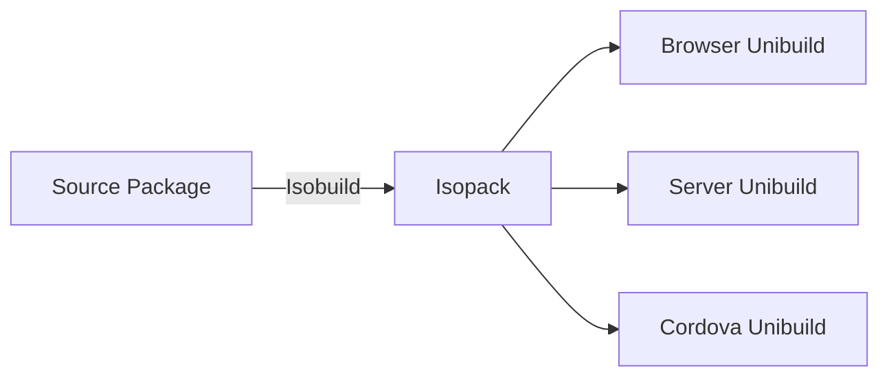
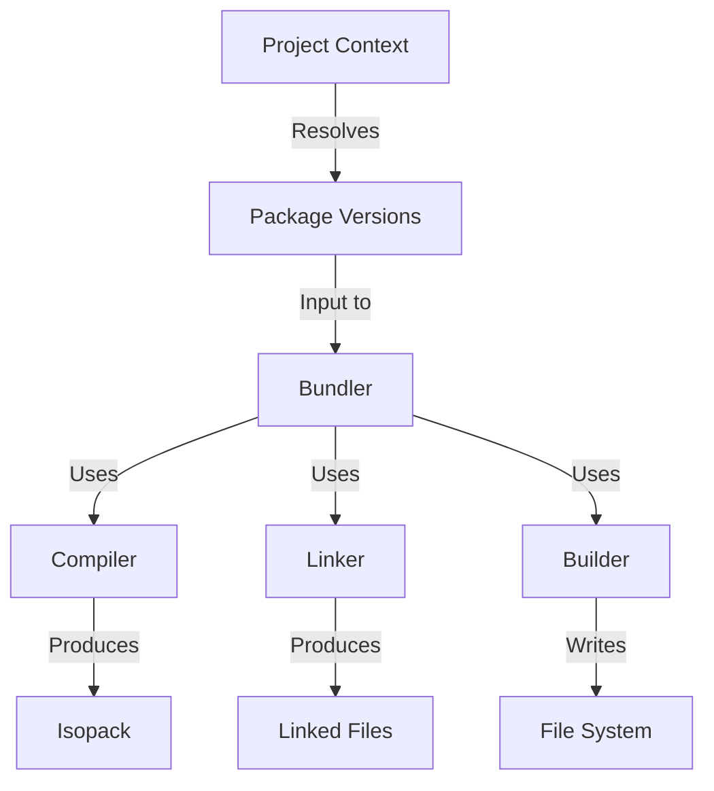

## What is Isobuild?

Isobuild is Meteor's packaging and build system. The name comes from "isomorphic build" - it compiles the same JavaScript codebase to different architectures: browser, Node.js server, Cordova mobile apps, and even the Meteor tool itself.

<Note>
  Isobuild knows how to compile the same JavaScript code-base to different architectures: browser, node.js-like server environment (could be Rhino or other) or a webview in a Cordova mobile app.
</Note>

## Core Concepts

### Isopack

Each package used by Isobuild forms an **Isopack** - a package format containing compiled source code for each architecture it can run on.



### Unibuild

Each separate part of an Isopack built for a specific architecture is called a **Unibuild**.

<Info>
  The name "Unibuild" is historical - we can't call it "build" (too generic) or "Isobuild" (that's the system name). A Unibuild represents a single architecture target within an Isopack.
</Info>

### Isopackets

**Isopackets** are predefined sets of isopacks used inside meteor-tool. The meteor command-line tool loads isopackets into its process to use features like the DDP client.

## Build Process Architecture

The Isobuild system consists of several interconnected components:



## Key Components

### 1. Project Context

Created from the app directory, the Project Context:

- Resolves package versions and dependencies
- Refreshes package catalogs
- Prepares packages for building
- Manages constraint solving

Located in: `tools/project-context.js`

### 2. Bundler

The Bundler is the high-level orchestrator. It:

- Creates Package Sources for the app
- Compiles app parts as packages
- Combines everything into deployable bundles
- Writes `star.json` and `program.json` files

<CodeGroup>
```javascript Main Entry Points
// Build a build plugin
bundler.buildJsImage(options);

// Bundle the application
bundler.bundle({
  projectContext,
  outputPath,
  buildOptions
});
```

```javascript Bundler Tasks
// 1. Create Package Source for app
const appPackageSource = new PackageSource(...);

// 2. Run linters
runLinters(packageSource);

// 3. Compile with Linker
const linkedFiles = linker.fullLink(files);

// 4. Write to disk
builder.write(outputPath, files);

// 5. Generate metadata
writeStarJson(metadata);
writeProgramJson(programMetadata);
```
</CodeGroup>

Located in: `tools/isobuild/bundler.js`

### 3. Compiler

The Compiler handles individual package compilation:

- Compiles packages into Isopacks
- Runs compiler batch plugins
- Executes source handlers (legacy build plugins)
- Recursively builds build plugins if needed

```javascript
// Compiler has a dependency on Bundler
// because build plugins are themselves bundled apps
const isopack = compiler.compile(packageSource, {
  packageMap,
  isopackCache,
  includeCordovaUnibuild
});
```

Located in: `tools/isobuild/compiler.js`

### 4. Linker

The Linker is Meteor's module loading solution. It wraps files and manages imports/exports.

<AccordionGroup>
  <Accordion title="Prelink Phase">
    Done in isolation per package:
    
    1. Create closure around each file
    2. Concatenate all files
    3. Add source comments and metadata
    4. Parse JS to find global variables
    5. Create package-level variables with `var`
    
    ```javascript Before
    // File 1
    MyVariable = 'value';
    
    // File 2
    console.log(MyVariable);
    ```
    
    ```javascript After Prelink
    (function() {
      var MyVariable;  // Package-level variable
      
      // File 1
      MyVariable = 'value';
      
      // File 2
      console.log(MyVariable);
    })();
    ```
  </Accordion>
  
  <Accordion title="Link Phase">
    Done when dependency versions are known:
    
    1. Create import strings for dependencies
    2. Add global imports from package exports
    
    ```javascript
    (function() {
      // Global imports from dependencies
      var Minimongo = Package.minimongo.Minimongo;
      var EJSON = Package.ejson.EJSON;
      var Tracker = Package.tracker.Tracker;
      
      // Package-level variables
      var MyCollection;
      
      // Your code
      MyCollection = new Mongo.Collection('items');
    })();
    ```
  </Accordion>
</AccordionGroup>

Located in: `tools/isobuild/linker.js`

<Info>
  The Linker predates ES2015 modules. Meteor is transitioning to native ES modules, but the Linker remains for backwards compatibility.
</Info>

### 5. Builder

The Builder manages filesystem writes efficiently:

- Tracks which files have changed
- Avoids rewriting unchanged files
- Uses inodes (not file paths) for running processes
- Cleans up unlinked files

```javascript
const builder = new Builder({
  outputPath: '/path/to/build'
});

// Write files efficiently
builder.write('client.js', clientCode);
builder.write('server.js', serverCode);

// Builder only writes changed files
builder.complete();  // Finish and cleanup
```

Located in: `tools/isobuild/builder.js`

## Build Pipeline

Here's the complete timeline of building a Meteor app:

### Step 1: Create Project Context

```javascript
const projectContext = new ProjectContext({
  projectDir: '/path/to/app',
  serverArchitectures: ['os.linux.x86_64'],
  allowIncompatibleUpdate: false
});

await projectContext.readProjectMetadata();
await projectContext.initializeCatalog();
await projectContext.resolveConstraints();
```

This:
- Reads `.meteor/packages` and `.meteor/release`
- Resolves package versions via constraint solver
- Prepares packages from cache or downloads them

### Step 2: Bundle the Application

```javascript
const bundle = bundler.bundle({
  projectContext,
  outputPath: '.meteor/local/build',
  buildOptions: {
    minifyMode: 'development',
    webArchs: ['web.browser'],
    serverArchs: ['os.linux.x86_64']
  }
});
```

The Bundler:
1. Creates Package Source for the app
2. Compiles app code for each architecture
3. Links modules and resolves imports
4. Runs minifiers in production mode
5. Writes output files

### Step 3: Compile Packages

For each package:

```javascript
const isopack = compiler.compile(packageSource, options);
```

The Compiler:
1. Runs compiler plugins (`.jsx` → `.js`, `.ts` → `.js`, etc.)
2. Processes each architecture (client, server, cordova)
3. Creates Unibuilds for each architecture
4. Assembles Isopack from Unibuilds
5. Caches result in `.meteor/local/isopacks/`

### Step 4: Link Modules

```javascript
const linkedFiles = linker.fullLink(files, {
  imports: packageDependencies,
  exports: packageExports,
  useGlobalNamespace: true
});
```

The Linker:
1. Prelinking: Wraps files, creates package scope
2. Linking: Adds import statements
3. Generates global imports file

### Step 5: Write Output

```javascript
builder.write(outputPath, files);
builder.writeJson('star.json', starMetadata);
```

Creates the final bundle structure:

```
.meteor/local/build/
├── star.json
├── programs/
│   ├── server/
│   │   ├── program.json
│   │   ├── server.js
│   │   └── npm/node_modules/
│   └── web.browser/
│       ├── program.json
│       ├── index.html
│       └── app/*.js
```

### Step 6: Return WatchSet

The WatchSet tracks all files involved in the build:

```javascript
const watchSet = bundle.watchSet;

// Monitor for changes
watchSet.on('change', (changedFiles) => {
  // Rebuild affected parts
});
```

## Build Plugins

Build plugins extend Isobuild's compilation capabilities.

### Compiler Plugin

Compiles specific file types:

```javascript
Package.registerBuildPlugin({
  name: 'compile-ecmascript',
  use: ['babel-compiler'],
  sources: ['plugin.js']
});
```

Plugin implementation:

```javascript plugin.js
Plugin.registerCompiler({
  extensions: ['js', 'jsx'],
}, () => new BabelCompiler());

class BabelCompiler {
  processFilesForTarget(files) {
    files.forEach(file => {
      const compiled = babel.transform(file.getContentsAsString(), {
        presets: ['@babel/preset-react']
      });
      
      file.addJavaScript({
        path: file.getPathInPackage(),
        data: compiled.code,
        sourceMap: compiled.map
      });
    });
  }
}
```

### Minifier Plugin

Minifies compiled output:

```javascript
Plugin.registerMinifier({
  extensions: ['js']
}, () => new MyMinifier());

class MyMinifier {
  processFilesForBundle(files, options) {
    files.forEach(file => {
      const minified = minify(file.getContentsAsString());
      file.addOutput(minified);
    });
  }
}
```

### Linter Plugin

Lints source code:

```javascript
Plugin.registerLinter({
  extensions: ['js', 'jsx']
}, () => new ESLintPlugin());
```

## Caching

### Isopack Cache

Compiled packages are cached in `.meteor/local/isopacks/`:

```
.meteor/local/isopacks/
├── meteor/
├── mongo/
├── tracker/
└── ddp-client/
```

Each contains:
- `isopack.json` - Metadata
- `web.browser/` - Client unibuild
- `os/` - Server unibuild

### Cache Invalidation

Caches are invalidated when:
- Source files change
- Package dependencies update
- Build plugin configuration changes
- Meteor version changes

## WatchSet

WatchSets track file dependencies for rebuilds:

```javascript
const watchSet = new WatchSet();

// Files are added during build
watchSet.addFile('/path/to/app/client/main.js');
watchSet.addFile('/path/to/app/imports/api/tasks.js');

// Check for changes
const changed = watchSet.check();
if (changed) {
  rebuild();
}
```

<Info>
  The WatchSet is passed down through build functions and mutated to accumulate all dependencies. The final WatchSet contains every file that participated in the build.
</Info>

## Architecture Targets

Isobuild compiles for multiple architectures:

### Web Architectures

- `web.browser` - Modern browsers
- `web.browser.legacy` - Legacy browser support
- `web.cordova` - Cordova mobile apps

### Server Architectures

- `os` - Platform-independent Node.js
- `os.linux.x86_64` - Linux 64-bit
- `os.osx.x86_64` - macOS 64-bit
- `os.windows.x86_64` - Windows 64-bit

### Example Target Selection

```javascript package.js
api.addFiles('shared.js', ['client', 'server']);
api.addFiles('browser-only.js', 'web.browser');
api.addFiles('cordova-only.js', 'web.cordova');
api.addFiles('server-only.js', 'server');
```

## Performance Optimization

### Parallel Compilation

Isobuild compiles packages in parallel when possible:

```javascript
// Packages without dependencies compile in parallel
Promise.all([
  compile('tracker'),
  compile('reactive-var'),
  compile('ejson')
]);
```

### Incremental Builds

Only recompile changed packages:

```javascript
if (packageCache.has(packageName) && !hasChanged(packageName)) {
  return packageCache.get(packageName);
}
return compile(packageName);
```

### Build Profiling

```bash
# Enable profiling (200ms cutoff)
METEOR_PROFILE=200 meteor run

# Advanced profiling with inspector
METEOR_INSPECT=bundler.bundle meteor build
```

## Best Practices

<AccordionGroup>
  <Accordion title="Understand Build Targets">
    Be aware of which architecture your code targets:
    
    ```javascript
    // Good - explicit targeting
    if (Meteor.isServer) {
      const fs = require('fs');
    }
    
    // Bad - will fail on client
    const fs = require('fs');  // Node.js only!
    ```
  </Accordion>
  
  <Accordion title="Optimize Imports">
    Use tree-shaking friendly imports:
    
    ```javascript
    // Good - tree-shakeable
    import { specific } from 'package';
    
    // Less optimal - imports everything
    import * as all from 'package';
    ```
  </Accordion>
  
  <Accordion title="Leverage Caching">
    Let Isobuild cache work:
    
    - Don't clean `.meteor/local/` unnecessarily
    - Use deterministic build plugin output
    - Avoid dynamic imports in package.js
  </Accordion>
</AccordionGroup>

<Card title="Next: Reactivity" icon="bolt" href="/concepts/reactivity">
  Learn how Meteor's reactive system automatically updates your UI
</Card>
