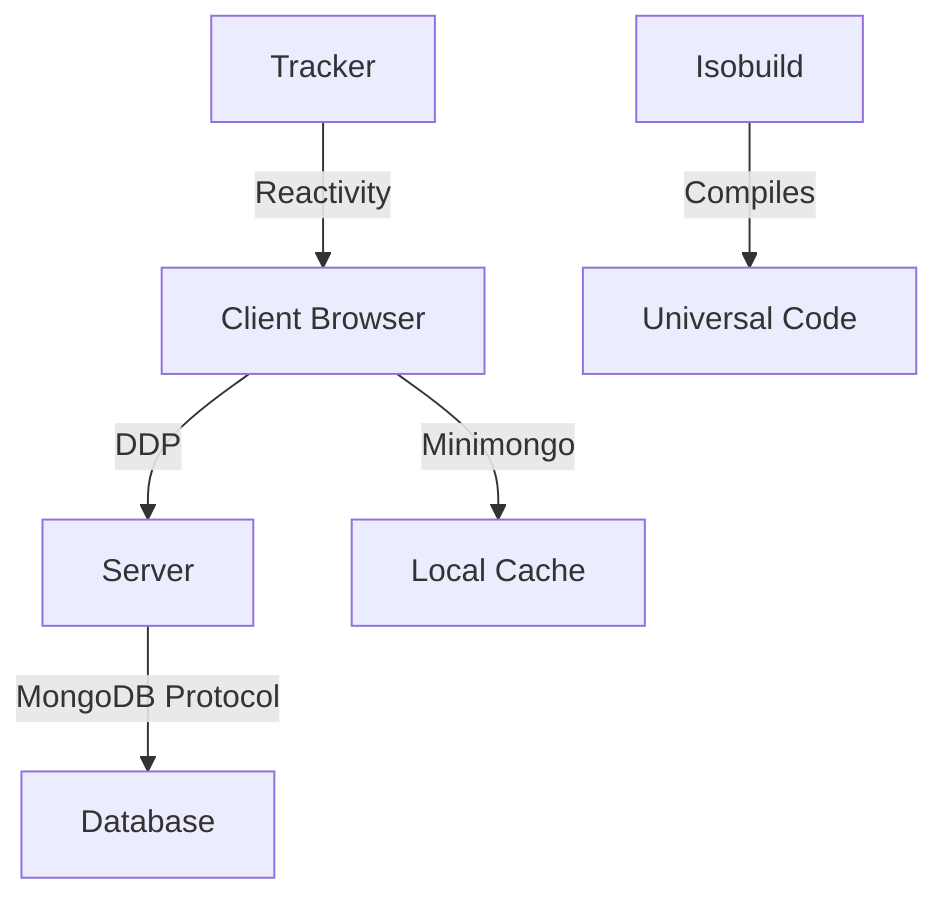

## What is Meteor?

Meteor is an **ultra-simple** environment for building **modern** web applications. It's a full-stack JavaScript platform that enables rapid prototyping and development using the latest technology.

<Note>
  Meteor allows you to use the same code whether you're developing for web, iOS, Android, or desktop for a seamless update experience for your users.
</Note>

## Core Philosophy

Meteor is built on several key principles:

### Full-Stack JavaScript

Write your entire application in JavaScript, from client to server to database. This unified language approach eliminates context switching and enables code sharing across environments.

### Data on the Wire

Instead of sending HTML over the network, Meteor sends data and lets the client render it. The server sends raw data through the DDP (Distributed Data Protocol) protocol, and the client decides how to display it.

### Database Everywhere

Access your database from both client and server using the same API. Minimongo, Meteor's client-side database, mirrors the MongoDB API and automatically syncs with the server.

### Latency Compensation

Meteor simulates database operations on the client (optimistic UI) before the server responds. When the server result arrives, the client seamlessly reconciles any differences.

### Reactivity

Meteor's reactivity system (powered by Tracker) automatically updates your UI when data changes. No manual event handlers or callback wiring required.

## Architecture Components

Meteor's architecture consists of several interconnected systems:



### The Meteor Tool

The `meteor` command-line tool (meteor-tool) is the entry point for all Meteor development:

- **CLI commands**: Located in `tools/cli/commands.js`
- **Build system**: Powered by Isobuild in `tools/isobuild/`
- **Development server**: Hot reloading and live updates
- **Package management**: Integration with Atmosphere and npm

<CodeGroup>
```bash Basic Commands
# Create a new app
meteor create my-app

# Run development server
meteor run

# Add packages
meteor add <package-name>

# Build for production
meteor build ../output
```

```bash Development Commands
# Run from source
./meteor run

# Run tests
./meteor test-packages ./packages/<name>

# Self-test the CLI
./meteor self-test
```
</CodeGroup>

### Package System

Meteor includes over 140+ core packages organized by domain:

<CardGroup cols={2}>
  <Card title="Database" icon="database">
    `mongo`, `minimongo`, `ddp-server`, `ddp-client`
  </Card>
  <Card title="Build Tools" icon="hammer">
    `babel-compiler`, `ecmascript`, `typescript`, `rspack`
  </Card>
  <Card title="Authentication" icon="lock">
    `accounts-base`, `accounts-password`, `accounts-oauth`
  </Card>
  <Card title="Reactivity" icon="bolt">
    `tracker`, `reactive-var`, `reactive-dict`
  </Card>
</CardGroup>

### Runtime Environment

Meteor provides a unified runtime environment across platforms:

- **Server**: Node.js environment with full access to npm packages
- **Client**: Modern browsers with ES2015+ support via Babel
- **Mobile**: Cordova integration for iOS and Android
- **Desktop**: Electron support for cross-platform desktop apps

## Development Workflow

### 1. Project Structure

A typical Meteor app follows this structure:

```bash
my-app/
├── client/          # Client-only code
├── server/          # Server-only code
├── imports/         # Lazy-loaded modules
├── public/          # Static assets
├── tests/           # Test files
└── package.json     # npm dependencies
```

### 2. Build Process

The Meteor build process (handled by Isobuild) follows these steps:

1. **Project Context**: Resolves package versions and dependencies
2. **Compilation**: Compiles packages and app code for each target
3. **Linking**: Wraps modules and sets up imports/exports
4. **Bundling**: Combines everything into deployable bundles
5. **Output**: Generates `star.json` and platform-specific programs

<Tip>
  The build system automatically detects file changes and triggers hot module replacement in development mode.
</Tip>

### 3. Hot Module Replacement

Meteor supports fast refresh for React and automatic reloading:

- **react-fast-refresh**: Preserves component state during updates
- **autoupdate**: Pushes new code to connected clients
- **reload**: Manages client-side reloading strategy

## Modern Features

Meteor 3.x introduces several modern improvements:

- **Async/Await**: Full Promise support throughout the stack
- **ESM Modules**: Native ES module support
- **TypeScript**: First-class TypeScript integration
- **Modern Bundlers**: Rspack for faster builds
- **React 18**: Support for latest React features

## Next Steps

<CardGroup cols={2}>
  <Card title="Project Structure" href="/concepts/project-structure" icon="folder-tree">
    Learn how Meteor organizes files and directories
  </Card>
  <Card title="Package System" href="/concepts/packages" icon="box">
    Understand Meteor's modular package architecture
  </Card>
  <Card title="Isobuild" href="/concepts/isobuild" icon="hammer">
    Deep dive into Meteor's build system
  </Card>
  <Card title="Reactivity" href="/concepts/reactivity" icon="bolt">
    Master Tracker and reactive programming
  </Card>
</CardGroup>
